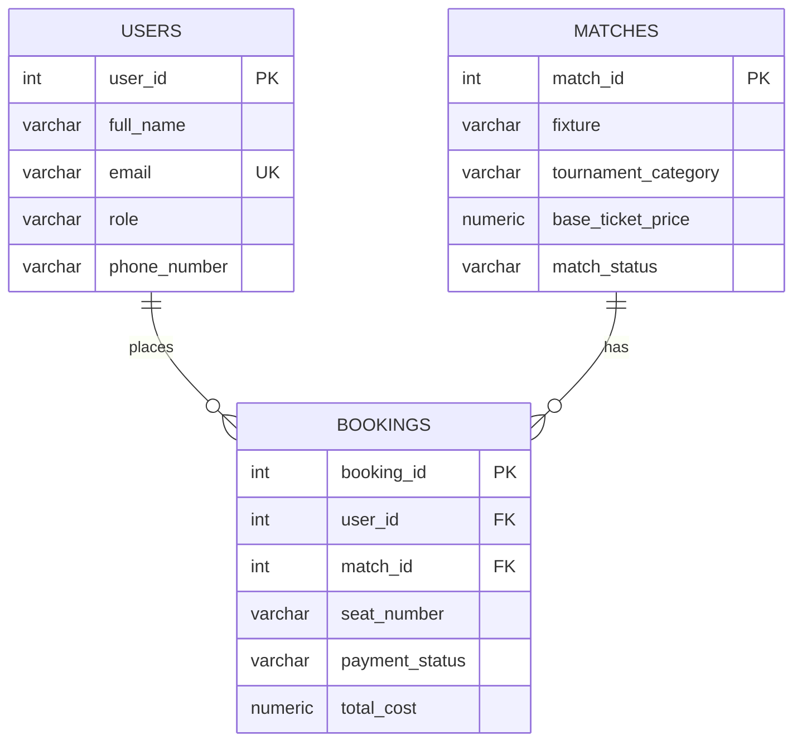

# Football Ticket Booking System 🎫⚽

A relational database design and SQL query assignment implementing a **Football Ticket Booking System** using PostgreSQL.

---

## 📐 ERD Diagram

🔗 **[View Public ERD on Google Drive](https://drive.google.com/file/d/1wBQJW6-1fNK13GA5o4Bqk1e4fDQxDHJK/view?usp=sharing)**



### Relationships

| Relationship | Description |
|---|---|
| **One to Many** | One `User` → Many `Bookings` (a fan can buy tickets for multiple matches) |
| **Many to One** | Many `Bookings` → One `Match` (a match can have thousands of bookings) |
| **One to One (logical)** | Each `Booking` row maps exactly one user to one match for a specific seat |

---

## 🗂️ Project Structure

```
Football Ticket Booking System/
├── Query.sql          # DDL schema + sample data + all SQL queries
├── theory_answers.md  # Written answers to 3 theory questions
├── README.md          # Project overview + ERD
└── .gitignore
```

---

## 🗄️ Database Schema

### Users Table

| Field | Type | Constraints |
|---|---|---|
| `user_id` | `INT` | `PRIMARY KEY` |
| `full_name` | `VARCHAR(100)` | `NOT NULL` |
| `email` | `VARCHAR(100)` | `UNIQUE NOT NULL` |
| `role` | `VARCHAR(20)` | `CHECK ('Ticket Manager', 'Football Fan')` |
| `phone_number` | `VARCHAR(20)` | Nullable |

### Matches Table

| Field | Type | Constraints |
|---|---|---|
| `match_id` | `INT` | `PRIMARY KEY` |
| `fixture` | `VARCHAR(150)` | `NOT NULL` |
| `tournament_category` | `VARCHAR(100)` | `NOT NULL` |
| `base_ticket_price` | `NUMERIC(10,2)` | `CHECK (>= 0)` |
| `match_status` | `VARCHAR(20)` | `CHECK ('Available','Selling Fast','Sold Out','Postponed')` |

### Bookings Table

| Field | Type | Constraints |
|---|---|---|
| `booking_id` | `INT` | `PRIMARY KEY` |
| `user_id` | `INT` | `FOREIGN KEY → Users(user_id)` |
| `match_id` | `INT` | `FOREIGN KEY → Matches(match_id)` |
| `seat_number` | `VARCHAR(10)` | Nullable |
| `payment_status` | `VARCHAR(20)` | `CHECK ('Pending','Confirmed','Cancelled','Refunded')`, Nullable |
| `total_cost` | `NUMERIC(10,2)` | `CHECK (>= 0)` |

---

## ▶️ How to Run

**Prerequisites:** PostgreSQL installed and running.

```bash
# Connect to PostgreSQL and execute the script
psql -U postgres -d postgres -f Query.sql
```

This will:
1. Drop existing tables (if any)
2. Create all three tables with proper constraints
3. Insert sample data
4. Execute all 7 SQL queries

---

## 📋 SQL Queries Summary

| # | Query Description | Concepts |
|---|---|---|
| 1 | Champions League matches with `Available` status | `WHERE`, `AND` |
| 2 | Users named `Tanvir` or containing `Haque` | `ILIKE`, `OR` |
| 3 | Bookings with missing payment status → `Action Required` | `IS NULL`, `COALESCE` |
| 4 | Bookings with user name and match fixture | `INNER JOIN` |
| 5 | All users + booking IDs (including fans with no bookings) | `LEFT JOIN` |
| 6 | Bookings with total cost above average | Subquery, `AVG()` |
| 7 | Top 2 matches by price, skipping the most expensive | `ORDER BY`, `LIMIT`, `OFFSET` |

---

## 🎓 Assignment Details

- **Course:** Programming Hero
- **Topic:** Database Design & SQL Queries
- **Database:** PostgreSQL
